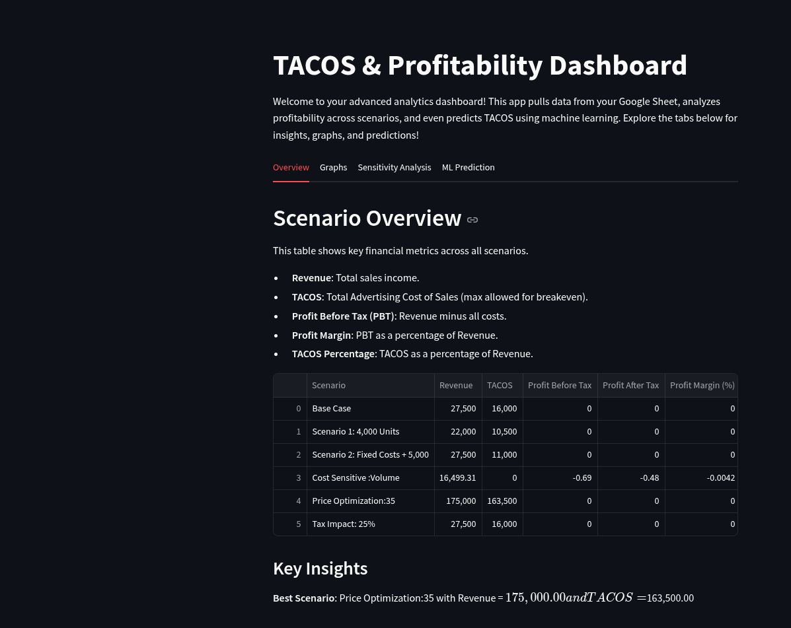
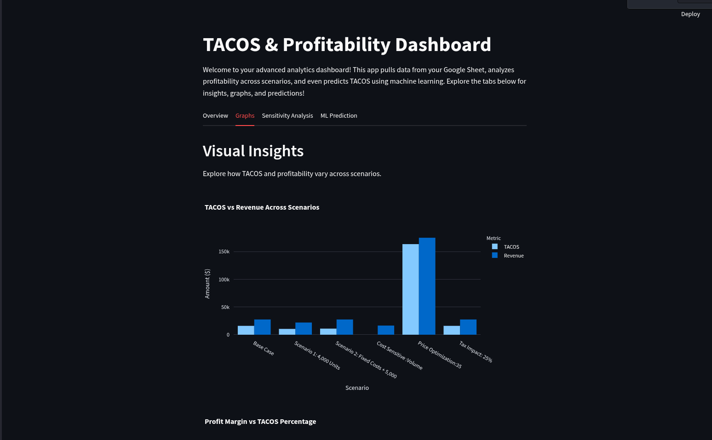
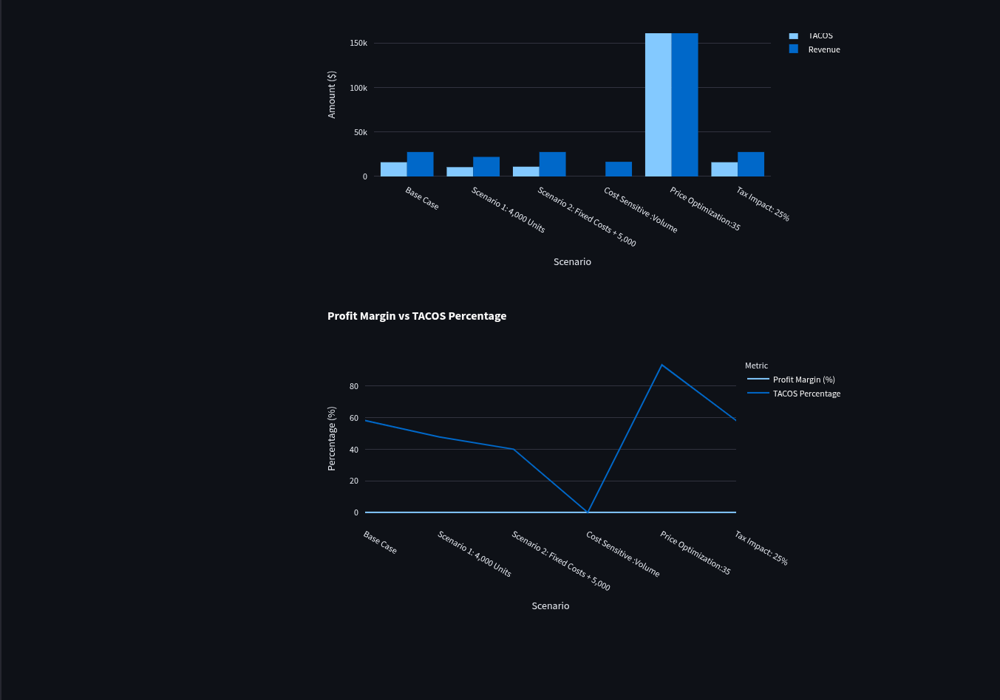
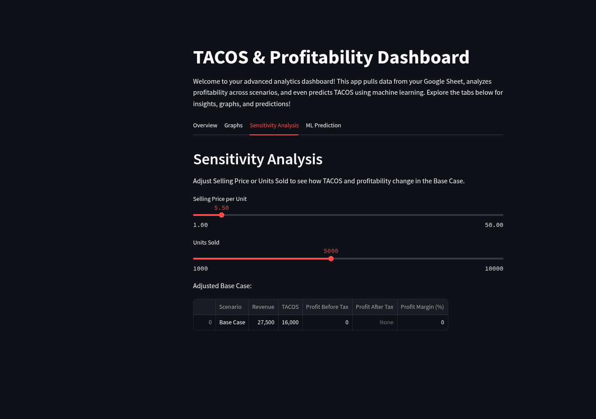
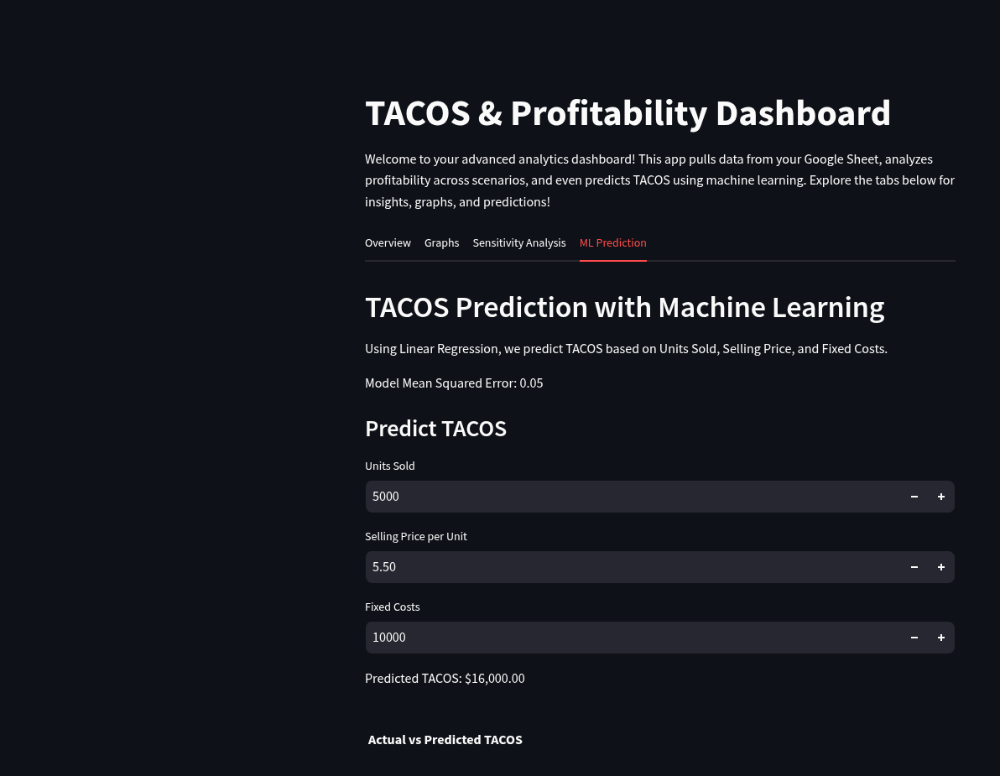

# TACOS & Profitability Dashboard

Welcome to the TACOS & Profitability Dashboard! This advanced analytics dashboard pulls data from a Google Sheet, analyzes profitability across scenarios, and predicts TACOS using machine learning.

## Features

- **Overview Tab**: Displays key financial metrics across all scenarios.
- **Graphs Tab**: Visual insights into TACOS and profitability variations.
- **Sensitivity Analysis Tab**: Adjust selling price or units sold to see changes in TACOS and profitability.
- **ML Prediction Tab**: Predict TACOS using Linear Regression based on units sold, selling price, and fixed costs.

## Setup Instructions

1. **Clone the repository**:
    ```sh
    git clone https://github.com/yourusername/tacos-profitability-dashboard.git
    cd tacos-profitability-dashboard
    ```

2. **Install dependencies**:
    ```sh
    pip install -r requirements.txt
    ```

3. **Add your Google Sheets API credentials**:
    - Place your `amazing-city1.json` file in the root directory of the project.

4. **Run the Streamlit app**:
    ```sh
    streamlit run sheetanalysis.py
    ```

## Getting Google Sheets API Key

Objective: Guide you to download the JSON key file from Google Cloud Console and use it in Python to access your sheet.

1. **Get the JSON Key File from Google Cloud Console**
    - Go to [Google Cloud Console](https://console.cloud.google.com/).
    - Sign in with your Google account if you’re not already logged in.

2. **Select Your Project**
    - At the top, click the project dropdown (it might say “Select a project” or show “amazing-city-451104-t5” if you’ve already created it).
    - If you don’t see your project, click **New Project**, name it (e.g., “TACOS Analysis”), and create it. Note the project ID (e.g., amazing-city-451104-t5).

3. **Navigate to Credentials**
    - In the left sidebar, go to **APIs & Services** > **Credentials**.

4. **Find or Create the Service Account**
    - Look under **Service Accounts**. If you see `sheets-access@amazing-city-451104-t5.iam.gserviceaccount.com`, click it.
    - If it’s not there:
        - Click **+ Create Credentials** > **Service Account**.
        - Name: `sheets-access`.
        - ID: Leave as-is or it’ll auto-fill (should match `sheets-access@amazing-city-451104-t5`).
        - Role: Select **Editor** (or **Basic** > **Editor**).
        - Click **Create and Continue**, then **Done**.

5. **Download the JSON Key**
    - Under the service account, click the email (`sheets-access@amazing-city-451104-t5.iam.gserviceaccount.com`).
    - Go to the **Keys** tab.
    - Click **Add Key** > **Create new key** > **JSON** > **Create**.
    - A file (e.g., `amazing-city-451104-t5-abcdef123456.json`) will download to your computer. Save it somewhere accessible (e.g., your Desktop or project folder).

## Connecting Google Sheet to API Key

Objective: Share your Google Sheet with a specific email (e.g., the service account email) and grant editor access manually, then verify it works with Python.

1. **Open the Share Dialog in Google Sheets**
    - Open your Google Sheet (e.g., “TACOS Analysis - March 2025”).
    - Locate the Share button in the top-right corner—it’s usually on file tab or blue with a person-and-plus icon.
    - Click Share to open the sharing dialog box.

2. **Check the Sharing Interface**
    - You should see a section labeled “Share with people and groups” or similar.
    - There should be a text field where you can type or paste an email address. If you don’t see this field:
        - Possible Issue: The interface might look different if the sheet is already shared broadly (e.g., “Anyone with the link” is set to Editor).
        - Fix: Look for a “Restricted” or “Change” link near “General access” at the bottom of the dialog. Click it and set it to “Restricted” (only people you add can access). This should reveal the email input field.

3. **Add the Email Address**
    - In the “Add people and groups” field:
        - Paste the email address you want to share with (e.g., the service account email from your JSON file, like `sheets-access@tacos-analysis-123456.iam.gserviceaccount.com`).
        - If you can’t paste:
            - Try: Click into the field first, then right-click and select Paste, or use Ctrl+V (Windows) / Cmd+V (Mac).
        - Still No Field?: If it’s missing entirely, click the gear icon (⚙️) in the top-right of the share dialog and ensure no settings are hiding the input (e.g., “Editors can’t change permissions” shouldn’t affect adding new people).
        - After pasting the email, press Enter or wait for it to recognize the address.

4. **Set Editor Access**
    - Once the email appears in the list:
        - To the right of the email, you’ll see a dropdown (default might be “Editor”).
        - Click the dropdown and select Editor if it’s not already set. Options are:
            - Viewer: Can only view.
            - Commenter: Can view and comment.
            - Editor: Can edit (what you want for the service account).
        - If the dropdown is missing:
            - Possible Issue: The sheet might be locked by your organization’s admin settings.
            - Fix: Ensure you’re the owner (check under “Shared with” for your email as “Owner”). If not, ask the owner to grant you permission to share.

5. **Send or Save**
    - Check the “Notify people” box if you want an email sent (not necessary for a service account).
    - Click Send or Done to save the sharing settings.
    - Verify the email appears under “People with access” with “Editor” next to it.

## Usage

- Open the Streamlit app in your browser.
- Navigate through the tabs to explore different views and insights.
- Use the sliders in the Sensitivity Analysis tab to adjust parameters and see real-time changes.
- Use the ML Prediction tab to predict TACOS based on user inputs.

## Screenshots

### Overview Tab


### Graphs Tab



### Sensitivity Analysis Tab


### ML Prediction Tab


## Contributing

Feel free to submit issues or pull requests. For major changes, please open an issue first to discuss what you would like to change.

## License

This project is licensed under the MIT License.

